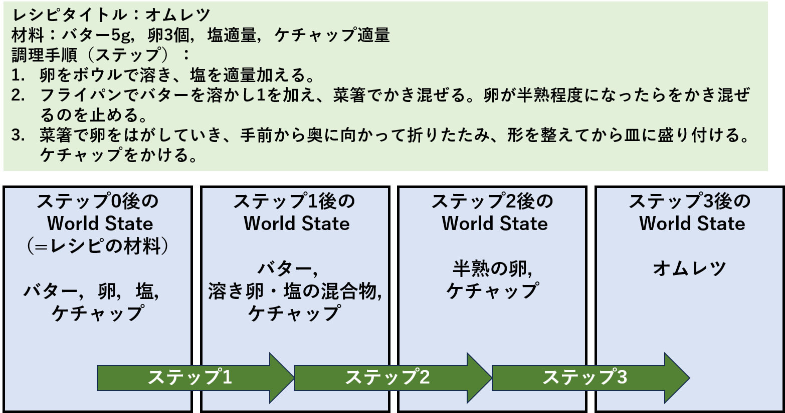

# 料理レシピ 調理器具アノテーション ガイドライン ver 1.0

> **目的：** 料理レシピの各調理手順において、材料や材料の中間生成物が「どの調理器具と接触するか」「どの調理容器・器具に入っているか」を正確にアノテーションするための基準を示す。本アノテーションは、LLM の調理器具推論能力を評価するためのベンチマークデータセット構築を目的とする。

## 目次（ [👀]は要確認）

**💡 初めに、0-1 ⇒ 0-2 ⇒ 2-1 ⇒7節 の順に読み、アノテーション内容の大筋を掴んでから3節を読んでください**

- [0. World State とアノテーション項目の定義](#0-world-state-と-アノテーション項目の定義)
    - [0-1. World State の定義](#0-1-world-state-の定義) [👀]
    - [0-2. アノテーション項目の定義](#0-2-アノテーション項目の定義) [👀]
- [1. アノテーションデータ件数と収集期間](#1-アノテーションデータ件数と収集期間)
    - [1-1. アノテーション対象データ](#1-1-アノテーション対象データ)
    - [1-2. アノテーション収集期間](#1-2-アノテーション収集期間)
- [2. アノテーションの流れ（予備アノテーション）](#2-アノテーションの流れ予備アノテーション)
  - [2-1. 全体の流れ](#2-1-全体の流れ) [👀]
  - [2-2. ツール画面の構成](#2-2-ツール画面の構成)
- [3. 各項目の入力基準](#3-各項目の入力基準)
  - [3-1. State の名前（name）](#3-1---state-の名前name)[👀]
  - [3-2. State の位置（touching_containers_id）](#3-2-state-の位置touching_containers_id) [👀]
  - [3-3. 生成元（source_state_id）](#3-3-生成元source_state_id) [👀]
  - [3-4. 使用器具（utensils_list）](#3-4-使用器具utensils_list) [👀]
- [4. 調理器具一覧](#4-調理器具一覧)
- [5. セルフチェックリスト](#5-セルフチェックリスト)
- [7. アノテーション例](#7-アノテーション例)  [👀]
- [更新履歴](#更新履歴)

---

## 0. World State と アノテーション項目の定義

#### 0-1. World State の定義
各レシピに対して World State を定義する。
- **World State** : 各調理手順（調理ステップ）の完了時点に存在するレシピの材料一覧（以降、材料一覧はレシピ情報に記載の材料を指す）や中間生成物（状態変化済の材料）の集合
- 例: 添付画像参照
- 以降、World State の要素ひとつひとつ（例：バター，溶き卵・塩の混合物・半熟の卵など）を **State** と定義
- ただし、今回のアノテーションでは、状態変化しなかった State に関しては、アノテーション簡略化のため記入しない（調理ステップ1後の State を例とすると、溶き卵・塩の混合物は記入するが、バターとケチャップは記入しない）。

 

#### 0-2. アノテーション項目の定義
各 State において下記の項目を定義する。詳しい説明は3節で紹介。
| 項目 | 呼び名 | 定義 | 例（ステップ1後の State） |
|:--:|:--:|:--:|:--:|
| `name` | State の名前 | State の名前, 最後の調理ステップではレシピタイトルを記入 | 溶き卵・塩の混合物 |
| `touching_containers_id` | State の位置 | State が調理ステップ完了時点で位置する（直接接触する）調理容器・器具を指す | ボウル |
| `source_state_id` | 生成元 | 生成元となる、以前の調理ステップ（前ステップ）までの State の name | 卵，塩 |
| `utensils_list` | 使用器具 | 生成元となる State と間接・直接接触する調理器具 |卵→ボウル，菜箸 / 塩→ボウル，菜箸（各生成元に対して記入）|

---

## 1. アノテーションデータ件数と収集期間

### 1-1. アノテーション対象データ
- レシピ 120 件
  - 予備：20件（10件ずつ）
  - 本番：100件
- 各レシピについて、調理ステップ1〜最終ステップ後までの[0-2節](#0-2-アノテーション項目の定義)の項目をアノテーション

### 1-2. アノテーション収集期間
- 予備1：6/29（月）～7/10（金）
- 予備2：7/13（月）～7/20（月）（仮）
- 本番：7/22（水）～8/5（水）（仮）

---

## 2. アノテーションの流れ（予備アノテーション）

予備アノテーションでのアノテーションの流れを説明する。本番アノテーションは後日説明を記載するが、アノテーションされたデータの正誤判定を行う作業がメインであり、予備アノテーションとは作業内容が異なる。

### 2-1. 全体の流れ

1. アノテーションナビで対象レシピ・対象調理ステップを選択
2. レシピタイトル・材料・調理手順を読み、レシピを理解
3. 「＋ State を追加」ボタンで、調理ステップで状態変化する（生成される） State を記入
4. 各 State について、[0-2節](#0-2-アノテーション項目の定義)で紹介した下記 4 項目を入力
   - **名前（name）：自由記述式**
   - **位置（touching_containers_id）：単一選択式**
   - **生成元の State（source_state_id）：単一選択式**
   - **生成元に対して使用する調理器具（utensils_list）：複数選択式**
5. 全件入力後、「💾 保存」ボタンで保存

> ⚠️ データの保存は「💾 保存」ボタンを押すまで確定されない。適宜保存すること（レシピ単位で保存を推奨）。

### 2-2. ツール画面の構成

左カラムから順に説明する。
| カラム名称 | 内容 |
|--------|------|
| アノテーションナビ | レシピ選択・調理ステップ選択・保存・読み込み |
| レシピ情報 | レシピタイトル・材料一覧・全調理手順（現在の調理ステップはハイライト表示） |
| アノテーション | アノテーション入力フォーム（ State の記入・編集） |
| 調理器具一覧 | 選択可能な調理器具の一覧 |

---

## 3. 各項目の入力基準

### 3-1.   State の名前（name）

その調理ステップで新たに生まれた・状態変化があった材料の状態を、簡潔な日本語で記述する。

#### 注意事項（命名条件）

- 命名形式は以下の優先順位を基本とする
    1. 材料グループ名やその状態の一般名称を利用（例：肉ダネ）
    2. 調理ステップでの最終操作内容＋材料名の形式（例：「みじん切りにした玉ねぎ」「炒めた豚肉」）
- 最終ステップはレシピタイトルそのまま（例：「夏野菜の野菜炒め」）
- 2の命名形式で複数の生成元の混合物の場合は「生成元A ・ B の混合物」のように記述
- 調味料が加えられた場合は省略可（操作が多く名前が長くなる場合は省略、短くなる場合は記載）
- 材料の一部のみ使われる場合：
    - 分割される場合は別々の  State として記入（例：「にんじん半量」と「残りのにんじん」）

| 操作 | 名前の例 |
|------|----------|
| 切る | みじん切りにした玉ねぎ |
| 炒める | 炒めた豚ひき肉 |
| 茹でる | 茹でたほうれん草 |
| 混ぜる | 溶き卵・醤油の混合物 |
| 調味 | 塩こしょうをして焼いた鶏肉，焼いた鶏肉 |

---

### 3-2. State の位置（touching_containers_id）

調理ステップ完了後に、その  State が直接**入っている・乗っている・置かれている**調理容器・器具を、調理器具一覧から 1 つ選択する。直接タイピングすることでドロップダウンの選択肢を絞り込むことも可能。

#### 選択基準

- 調理ステップ完了時点での最終的な位置のみ記録（途中経過の位置は記録しない）
    - 例）「炒めてから器に盛る」→ 最終位置は器であり、フライパンではない
- 調理器具一覧にある調理容器・器具を優先的に使用
    - ただし、調理器具一覧に存在しない場合や、調理容器・器具が指定されている場合は「一覧外」を選び、自由記述欄に記入
- 明示されていない場合は、適切だと考える調理容器・器具を選択
- コンロ・オーブン・電子レンジなどの冷熱源は原則含めない
    - ただしトースターなど容器を介せず「直火焼き」の場合は含めて良い
- まな板の上など一時的な場所も選択可
- 使用予定の調理容器・器具が既存の State で使用済で新しく使用したい場合は、「一覧外」を選び、自由記述欄に<"調理容器・器具名" + "-" + "当該器具が何個目か"> のように記入
    - 1個目は自由記述せず、2個目以降から例のように記入
    - 例）ボウル，ボウル-2，ボウル-3, ...

> 「鍋で炒めて、そのまま鍋に残す」場合、位置は「鍋」である。「鍋から取り出してボウルに移す」場合は「ボウル」である。

#### 想定質問

- Q1. 複数の調理容器・器具と接している場合（例：型にプリン液を注ぎ、天板に並べる→型？天板？）、どのように記入するか
    - A1. State が直に接している調理容器・器具を選択（例：→型が適切）
- Q2. 前ステップから State の位置に変化がなかった場合（例：n-1. 天板に並べたプリン液をオーブンで40分焼く，n. オーブンから取り出し、冷蔵庫で冷やす）、どのように記入するか
    - A2. オーブン・冷蔵庫は冷熱源であるため、記入しない。どちらも直に接触している調理容器は型である。そのため、前ステップの State の位置を継承して構わない（例：n-1. 型，n. 型 ⇒ どちらも型）

---

### 3-3. 生成元（source_state_id）

当該 State が**前ステップのどの State から生まれたか**を 1 行につき 1 件選択する。直接タイピングすることでドロップダウンの選択肢を絞り込むことも可能。

#### 選択基準

- 前ステップまでに記入された State （登録済 State）の中から選択
    - ドロップダウンには、材料一覧と登録済 State がある
    - 材料一覧の「全体備考参照」の記述は無視する
- 複数の材料が 1 つの  State になる場合（例：炒め合わせる、合わせる）、それぞれの材料を別行として記録
    - 「＋ ソースを追加」で行を追加し、それぞれの生成元を別行に記録
- 基本的にドロップダウンの選択肢は、1つの選択肢に対して1回のみ選択される
    - ただし、以下の場合は複数回選択して問題ない
        - 材料一覧で分量の記載がなく（油などの調味料が多い）、複数ステップで使用される場合
- 油を手に付ける場合は、調理器具と直接接しない、かつ材料としての用途の可能性は低いため、生成元として記入しない
- 同一調理ステップかつ同一 State で、同一登録済 State が二度に分けて登場する場合は、一度のみ記入
- 「一覧外（自由記述）」を選択するケース：
    - 生成元がドロップダウンにない場合（水など）は、自由記述欄に分量込みで記入（例：大さじ1の水）
        - 生成元としての水の取り扱い：
            - 材料として加わる水は生成元として記入
            - 野菜を洗うなど、材料として加わらず途中で捨てる水は記入不要

> ドロップダウンで ✅ マークが付いた選択肢は、以前に選択済みであることを示す。そのため、最終ステップですべての登録済 State に✅が付与されるはずである
---

### 3-4. 使用器具（utensils_list）

生成元が**調理手順に従って当該 State に状態変化する過程で直接・間接接触した調理器具**を、調理器具一覧からすべて選択する（複数可）。直接タイピングすることでドロップダウンの選択肢を絞り込むことも可能。

#### 接触方法の例
- **直接:** 材料を包丁で切る → 包丁，まな板
- **間接:** 材料を入れた鍋に蓋をする → 両手鍋・片手鍋，鍋の蓋
- ⇒どちらの接触方法でも使用器具として選択する

#### 注意事項

- 調理器具一覧にある器具から選択
    - ただし、一覧外（自由記述）を選択するケースを除く
- 明示されていなくとも（自明・省略されているものなど）自身で必要だと考える調理器具は全て選択
- **一覧外（自由記述）を選択するケース：**
    - 調理器具一覧から選択できない場合や調理器具が指定されている場合は、その器具名を記入
    - 使用予定の調理器具が登録済 State で選択済で新しく使用したい場合は、<"調理器具名" + "-" + "当該器具が何個目か"> のように記入
        - 1個目は自由記述せず、2個目以降から例のように記入
        - 例）ボウル，ボウル-2，ボウル-3, ...
- 複数の材料が 1 つの  State になり操作が加わる場合（例：炒め合わせる、合わせる）、すべての生成元（調味料含む）に対し統一して調理器具を記入
    - 例）調理手順：ハムを切って油をしいたフライパンで炒め、ハムの色が変わってきたらご飯とケチャップを加えて炒める（→ハムとご飯とケチャップをフライパン上で混合した後に炒める操作が加わる）
        - →生成元1：ハム，調理器具：まな板，包丁，フライパン，木製へら
        - →生成元2：油，調理器具：フライパン，木製へら
        - →生成元3：ご飯，調理器具：フライパン，木製へら
        - →生成元4：ケチャップ，調理器具：フライパン，木製へら
        - ⇒ このレシピの炒める操作に必要なフライパン，木製へらはすべての生成元に対して統一記入
    - そのため、「⬆ コピーボタン」で直前行の器具をコピー可能
        - 反応が遅いときは、反応されるまでボタンを押下
- 材料一覧は、すべて記載の分量で用意されている仮定するため、その材料を使用する際に計量器具（計量スプーンなど）を記入しない
    - ただし、材料一覧で分量が未記載の材料（調味料系や自由記述の材料が主）は、調理手順で新たに分量が記載されることが多い。そのような材料は、その調理ステップ時点で初めて用意すると考え、計量器具を使用する
- 「○○の場合、」など調理ステップで仮定文があった場合は、その仮定で使用する器具を記入
- 同一調理ステップかつ同一 State で、同一登録済 State が二度に分けて登場する場合は、生成元としては1つしか記入しないが、二度の操作で使用する器具を網羅的に記入
    - 例) 調理ステップ：大さじ1の油を刷毛で塗ってから肉を焼く。肉を返してから大さじ1の油をフライパンの縁から回し入れる。
    - → 使用器具：刷毛，計量スプーン，フライパン
- 理由がない限り、むやみに多くの類似用途器具を使用しない
    - 不適切な例）同一レシピにおいて、
        - ステップ1：卵を溶く，調理器具：ボウル，菜箸
        - ステップ2：溶いた卵に塩を入れて混ぜる，調理器具：ボウル，泡だて器
    - ⇒ステップ2でも菜箸を使用可能（泡だて器に変更する理由がない）
- コンロ・オーブン・電子レンジなどの冷熱源とキッチンタイマーは原則含めない
    - そのため、State に加わる操作が加熱・冷却単体のみの場合は、使用器具は空になる
    - ただしトースターなど容器を介せず「直火焼き」の場合は含めて良い

| 操作 | 使用器具の例 |
|------|-------------|
| 玉ねぎをみじん切りにする | 包丁，まな板 |
| フライパンで炒める | フライパン，菜箸など |
| 鍋で茹でる | 両手鍋・片手鍋など |
| ボウルで混ぜる | ボウル，泡立て器など |
| ザルで水切りする | ザル |
| ラップをかける | ラップフィルム |
| 皮をむく | ピーラーなど |
| 大さじ1の水（分量外）をボウルに加える | 計量スプーン，ボウル |
| （前ステップで材料をボウルに入れた上で）冷蔵庫に材料の入ったボウルを入れて30分間置いておく | （なし：加わる操作が冷却単体のため） |
| （前ステップ型にプリン液を入れた上で）天板にプリン液の入った型を並べ、オーブンに入れて30分間焼く | 型，天板（加わる操作が整列+加熱のため） |

#### 想定質問
- Q1. 調理器具の選択候補が複数存在します
    - A1. レシピを再現するために一番適切だと考える調理器具を選択
- Q2. 手で材料に操作を加えた場合（適量の塩を入れる、こねるなど）、使用器具にどう記入しますか
    - A2. 手などの体の一部は、調理器具として記入しない
- Q3. State に対して新しく調理器具を使用しない調理手順の場合（冷蔵庫に材料を入れるといった、冷熱源の介入による単なる移動など）、使用器具にどう記入しますか
    - A3. 空欄で保存（State の位置（touching_container_id）は記入）
- Q4. State の位置（touching_container_id）で記入した調理器具は、使用器具に含まれますか
    - A4. Q3の状況を除き、含まれる
- Q5. 前ステップで使用した調理器具は継続しますか
    - A5. 原則として、各調理手順で使用した器具のみを記入する。冷却・加熱（冷熱源の介入）のみの操作であれば、使用器具は存在しない。

| 状況 | 使用器具への記入 |
|------|----------------|
| 前ステップでボウルに入れており、今ステップで混ぜる操作あり | ボウル ＋ 泡立て器（今ステップで記入） |
| 前ステップでボウルに入れており、今ステップではボウルを冷蔵庫に入れるだけ | （なし：冷却だけで他の操作がないため記入しない） |
| 前ステップで鍋に材料を入れており、今ステップでは混ぜる必要あり | 両手鍋・片手鍋 ＋ 木製へら（今ステップで記入） |
| 前ステップで鍋に材料を入れており、今ステップでは鍋で10分間煮て放置するだけ | （なし：加熱だけで操作がないため記入しない） |

---

## 4. 調理器具一覧

- 調理器具は計50件
- 調理器具一覧カラムに表示されている調理器具が正式な選択肢
- State の位置，使用器具のドロップダウンに記載されているものと同一
- 用途が不明な調理器具がある場合は調べても良い
- 機能性やサイズなどは全て網羅していると仮定する
    - 例1) ステンレス / 鉄のフライパンを使用したい → どちらもフライパンを選択
    - 例2) 竹 / 平串を使用したい → どちらも串を選択
    - 例3) 直径15cm / 直径24cm のボウルを使用したい → どちらもボウルを選択

---

## 5. セルフチェックリスト

保存前に以下の項目を確認する。

- [ ] すべての  State に名前が入力されているか
- [ ] State の位置（touching_containers_id）がすべての  State に設定されているか
- [ ] 各 State に生成元（source_state_id）が設定されているか
- [ ] 調理器具を使わない場合を除き、使用器具（utensils_list）が設定されているか
- [ ] 各項目で注意事項を守っているか

---

## 7. アノテーション例

### 例 1：「じゃがいもは皮をむき、細切りにする」

| 項目 | 入力値 |
|-----------|-------|
|   State 名（name） | 細切りにしたじゃがいも |
| State の位置（touching_containers_id） | まな板 |
| 生成元（source_state_id） | じゃがいも（材料一覧） |
| 使用器具（utensils_list） | ピーラー、包丁、まな板 |

> 💡 ポイント：皮をむくためにピーラーも使用器具に含める。最終的にまな板の上にあるため、State の位置はまな板。

---

### 例 2：「フライパンでじゃがいもと豚肉を炒め合わせる」

1 つの  State ・2 行の生成元・使用器具として記入。

| 項目 | 入力値 |
|-----------|-------|
|   State 名（name） | じゃがいもと豚肉を炒め合わせたもの |
| State の位置（touching_containers_id） | フライパン |
| 生成元 1（source_state_id） | 細切りにしたじゃがいも（step 1） |
| 使用器具 1（utensils_list） | フライパン、菜箸 |
| 生成元 2（source_state_id） | 豚バラ肉（材料一覧） |
| 使用器具 2（utensils_list） | フライパン、菜箸 |

> 💡 ポイント：2 つの材料が 1 つになる場合、「＋ ソースを追加」で行を追加し、それぞれの生成元を別行に記入。

---

### 例 3：「パスタを茹で、ザルにあけて水をきり、皿に盛る。」

| 項目 | 入力値 |
|-----------|-------|
|   State 名（name） | 水をきったパスタ |
| State の位置（touching_containers_id） | 耐熱皿・器 |
| 生成元（source_state_id） | パスタ（材料一覧） |
| 使用器具（utensils_list） | 鍋、ザル、耐熱皿・器 |

> 💡 ポイント：State の位置は「調理ステップ完了時点」の容器。途中で使ったザルは使用器具に含め、State の位置にはならない。

---

## 更新履歴

| バージョン | 更新日 | 変更内容 |
|-----------|--------|---------|
| ver 1.0 | 2026-06-26 | 初版作成 |